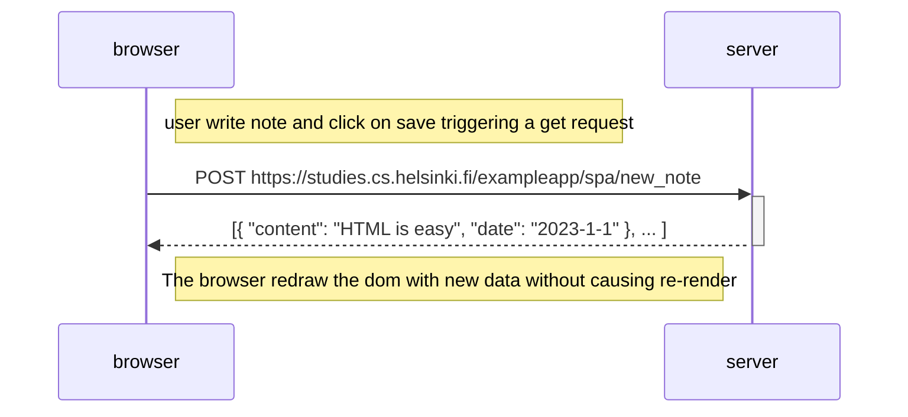

```mermaid
sequenceDiagram
    participant browser
    participant server

    Note right of browser: user write note and click on save triggering a get request

    browser->>server: POST https://studies.cs.helsinki.fi/exampleapp/spa/new_note
    activate server
   


    activate server
    server-->>browser: [{ "content": "HTML is easy", "date": "2023-1-1" }, ... ]
    deactivate server

    Note right of browser: The browser redraw the dom with new data without causing re-render
```

