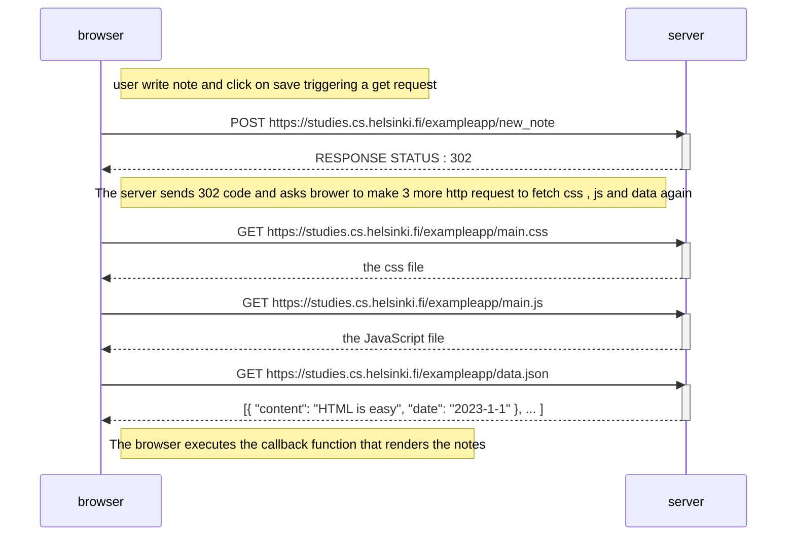

```mermaid
sequenceDiagram
    participant browser
    participant server

    Note right of browser: user write note and click on save triggering a get request

    browser->>server: POST https://studies.cs.helsinki.fi/exampleapp/new_note
    activate server
    server-->>browser: RESPONSE STATUS : 302
    deactivate server

    Note right of browser: The server sends 302 code and asks brower to make 3 more http request to fetch css , js and data again

    browser->>server: GET https://studies.cs.helsinki.fi/exampleapp/main.css
    activate server
    server-->>browser: the css file
    deactivate server

    browser->>server: GET https://studies.cs.helsinki.fi/exampleapp/main.js
    activate server
    server-->>browser: the JavaScript file
    deactivate server

    browser->>server: GET https://studies.cs.helsinki.fi/exampleapp/data.json
    activate server
    server-->>browser: [{ "content": "HTML is easy", "date": "2023-1-1" }, ... ]
    deactivate server

    Note right of browser: The browser executes the callback function that renders the notes
```

